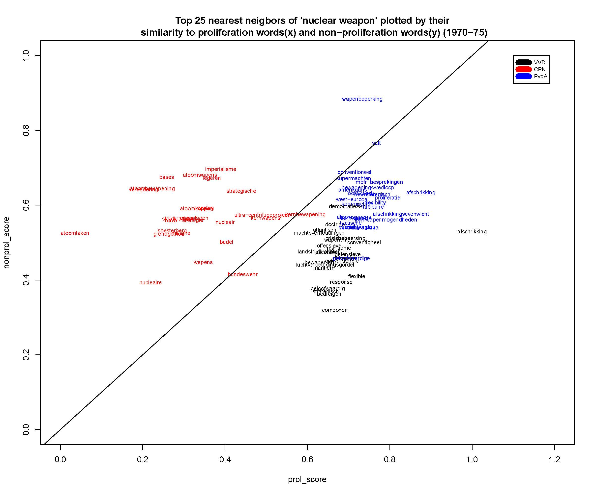

The NATO “double‐track decision” of 1979 envisioned the placement of nuclear weapons in the Netherlands, to which the Dutch government eventually agreed in 1985. In the early 1980s, the controversy regarding placement or non‐placement of these missiles led to the greatest popular protests in Dutch history and to a long and often bitter political controversy. After 1985, due to declining tensions between the Soviet Block and NATO, the cruise missiles were never stationed in the Netherlands. Much older nuclear warheads, in the country since the early 1960s, remain there until today. 

<i>By Ralf Futselaar and Milan van Lange</i>

We are using Word Embedding Models (WEMs) to analyse this acrimonious debate in the proceedings of the Dutch lower and upper house of Parliament during the 1970s and 1980s. The official political positions either for or against deployment, as expressed in party manifestos and voting behaviour inside parliament, were stable throughout this period. We demonstrate that in spite of this apparent stability, the vocabularies used by representatives of different political parties changed significantly through time.

<b>Data</b>

In this investigation we used a dataset of parliamentary records, known in Dutch as the Handelingen der Staten-Generaal. The data contains the verbatim minutes of both houses of parliament for the period 1814-1995. The dataset was first digitized by the Royal Library of the Netherlands and dramatically improved in the Political Mashup-project that ran from 2012 to 2016. The dataset consists of a large collection of XML files containing the complete minutes of all the meetings of the lower and upper chambers of parliament, separated by date, topic, political affiliation, etc. The corpus is not only sufficiently comprehensive for the creation of WEMs (an average of 1266 documents/topics per year for the period under scrutiny), but also complete. This makes it an excellent corpus for various forms of automated text analysis.

<b>Method</b> 

We have used the Handelingen and Google’s word2vec algorithm to train our WEMs. We started with the Dutch word for “nuclear weapon” (“kernwapen”) and identified its nearest neighbours (words close in vector space). We manually annotated all synonyms and near‐ synonyms of “nuclear weapon” used in the proceedings of both houses of parliament during the period under scrutiny.  By using the mean of all the vectors of these words, we have created a combined vector representing the concept, rather than the term, of “nuclear weapon” in vector space. Based on this combined vector we have identified nearest neighbours of words used to refer to nuclear weapons inside the WEMs. These terms have been manually classified, insofar relevant, into terms associated with a pro‐proliferation or anti‐proliferation viewpoint, for example “defense” and “disarmament” respectively. We used these viewpoint-associated words to create a pro-proliferation combined vector, and an anti-proliferation one.

From the perspective of historical research, WEMs have a fundamental weakness. Word vectors can only be compared with other vectors within the same spatial model. The same word in a different model may (and will) have an entirely different vector inside another model. Since change through time is the core of virtually all historical research (including this investigation), this presents us with a major problem; how can we compare outcomes for different periods in time? For this investigation, we have created a number of shifting windows, overlapping corpora which each contain the data from a specific time period of five years. We trained WEMs on each corpus. As explained, vectors from each of these separately trained models cannot as such be compared. To overcome this problem, we have used 250 words closely associated with the combined vector of “nuclear weapon” and calculated the cosine similarity of each of these 250 word vectors to the combined vectors representing the two different viewpoints (pro-proliferation and anti-proliferation). We repeated this for each of the models/windows. With these cosine-similarity-scores, we have created a measure to compare word vectors’ closeness outside a single model. 

This allows us to compare political discourses in discussions on nuclear weapons in relation to the two possible viewpoints in this bipolar debate. It is worthy to note that we have chosen a two-dimensional implementation in this case, but that this is not theoretically necessary. Using two viewpoints, each represented by a combined vector, does allow us to project the closeness of the top 250 nuclear-weapon-related words in each of the periods in a two-dimensional space in which one viewpoint serves as an y axis, the other as a x axis. Thus, we have arrived at a visual representation that allows for a comparison of closeness in WEMs for more than one corpus and hence for a comparison through time. Needless to say, it would be necessary, when using this approach, to use relatively similar corpora. For historical research into relatively short periods of parliamentary history, this is not particularly problematic.

<b>Results</b> 

Obviously, representatives of all Dutch political parties used words from both categories in parliamentary debates. It is almost impossible, after all, to engage in a discussion without ever using the terms used by your adversaries. At any given time, however, we demonstrate that different political parties could be shown to have clear preferences in terms of vocabulary. In the “discursive space” created by the binary opposition between pro‐ and contra‐proliferation words, political parties can be shown to have had specific and distinct ways of discussing nuclear weapons. We identify and distinguish the specific vocabularies used by the Communist (red), Social Democrat (blue), Christian Democrat (green) and Liberal (black) parties. 

     

Using this framework, we have analysed the changing vocabularies of different political parties. This allows us to show that, while stated policy positions and voting behaviour remained unchanged, the language used to discuss nuclear weapons shifted strongly towards anti‐proliferation terminology. We have also been able to show that this change happened at different times for different political parties. We speculate that these changes in the preferred “dialect” to discuss nuclear weapons resulted from perceived changes of opinion among the target electorates of different parties, as well as the changing geopolitical climate of the mid‐to‐late 1980s, where nuclear non‐proliferation became a more widely shared policy objective.

<b>Conclusion</b>

The uptake of WEMs in industries that use text mining as an integral part of their business model (Google, Facebook, etc.) has been rapid and almost comprehensive. Their sudden popularity owes much to their proven effectiveness. In historical research, by contrast, they have thus far not been used very much. This is doubtlessly due to a degree, to lack of expertise and ingrained conservatism within the historical profession. A much greater hindrance, thus far, was the lack of usability of WEMs for diachronic analysis. We believe that we have proposed a methodology to use WEMs in a meaningful way for historical enquiry. 
In the analysis of political speech, the resulting findings have a separate relevance. Political scientists often use vocabularies to predict or estimate political viewpoints. In the case at hand, we have demonstrated that when identified political viewpoints remain unchanged, politicians do adapt their vocabularies to appeal to the perceived views of their voters and potential voters. In this way, WEMs can help to analyse the ways in which political ideas are sold, successfully or unsuccessfully, to electorates. 
